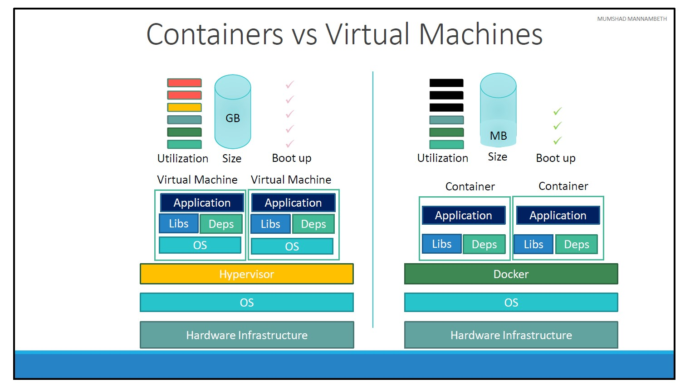
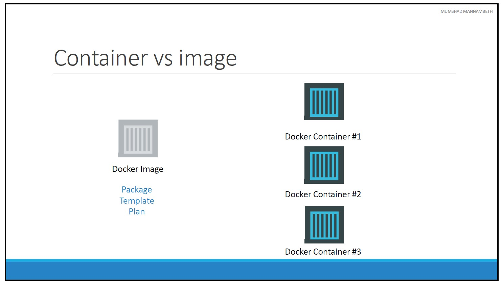
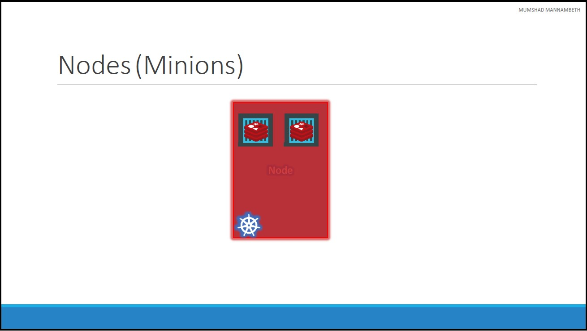
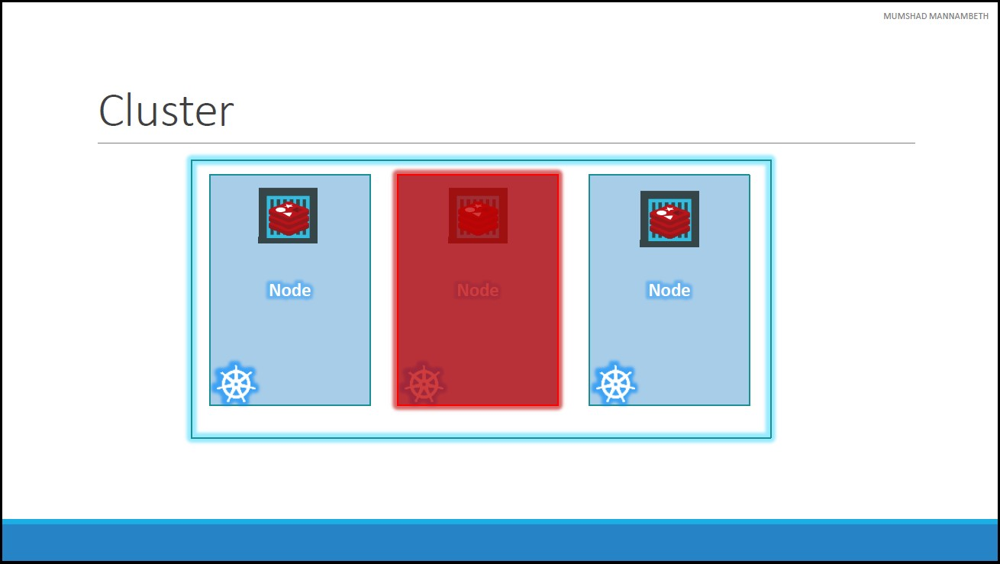
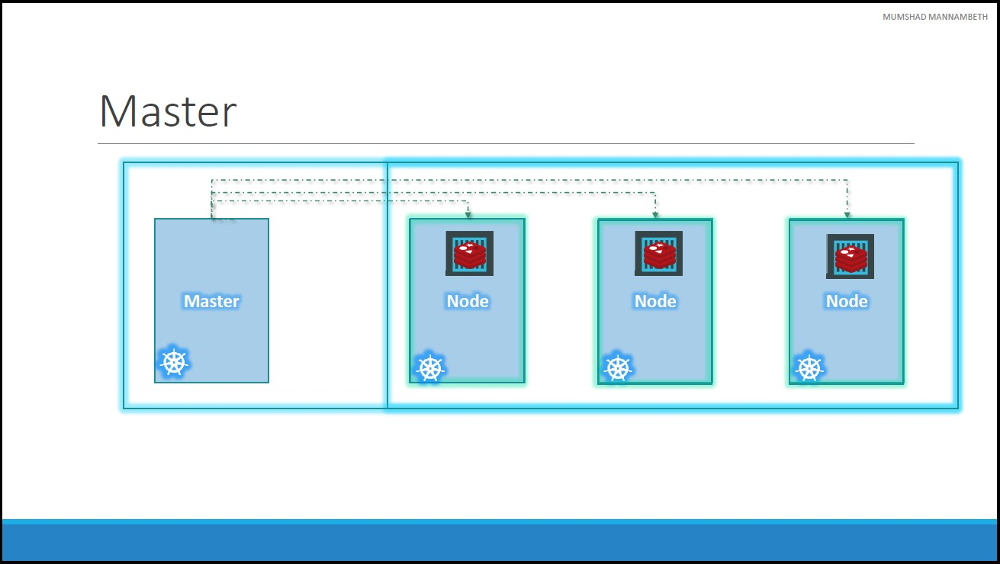
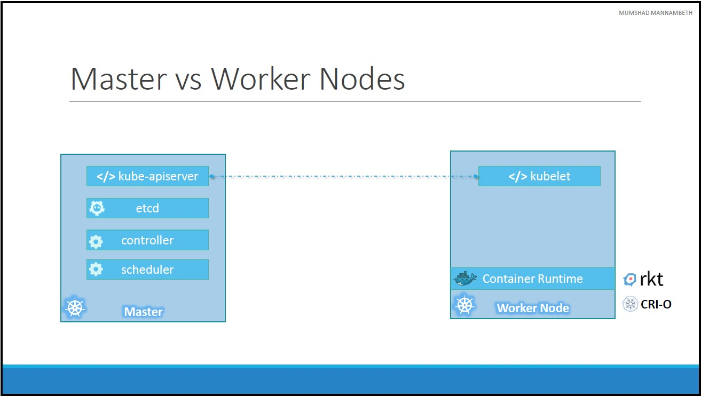

# Unit 2: Kubernetes Overview
## Containers Overview
### What are containers?
* **Containers** are completely isolated environments, as in they can have their own processes or services, their own network interfaces, their own mounts, just like Virtual machines, except that they all share the same OS kernel.  
* **Containers** have existed for about 10 years now and some of the different types of containers are _LXC_, _LXD_ , _LXCFS_ etc. [Docker](https://www.docker.com/) utilizes **LXC** containers. Setting up these container environments is hard as they are very low level and that is were Docker offers a high level tool with several powerful functionalities making it really easy for end users like us.

### Containers vs Virtual Machines

* Unlike hypervisors, Docker is not meant to virtualize and run different Operating systems and kernels on the same hardware. The main purpose of Docker is to containerize applications and to ship them and run them.
* It is also important to note that, Docker has less isolation as more resources are shared between containers like the kernel etc. Whereas VMs have complete isolation from each other. 
* Since VMs don’t rely on the underlying OS or kernel, you can run different types of OS such as linux based or windows based on the same hypervisor.

### Container vs Image

* An image is a package or a template, just like a VM template that you might have worked with in the virtualization world. It is used to create one or more containers.
* Containers are running instances off images that are isolated and have their own environments and set of processes.

## Container Orchestration
Container Orchestration is: 
* The whole process of automatically deploying and managing containers.
* Orchestrate the connectivity between the containers and automatically scale up or down based on the load.

### Orchestration Technologies
Examples of Orchestration Technologies
1. [Docker Swarms](https://docs.docker.com/engine/swarm/):
    * Easy to Setup and get started.
    * Lacks some of the advanced autoscaling features required for complex applications.
2. [Apache Mesos](https://mesos.apache.org/):
    * Quite difficult to setup and get started.
    * Supports many advanced features.
3. [Kubernetes](https://kubernetes.io/): 
    * The most popular of it all.
    * Bit difficult to setup and get started. 
    * Provides a lot of options to customize deployments and supports deployment of complex architectures.
    * Supported on all public cloud service providers like GCP, Azure and AWS.

## Kubernetes Architecture
### Basic Concepts
#### Nodes (Minions)

* A node is a machine physical or virtual on which kubernetes is installed. 
* A node is a worker machine and this is were containers will be launched by kubernetes.

#### Cluster

* A cluster is a set of nodes grouped together. 
* This way even if one node fails you have your application still accessible from the other nodes. 
* Having multiple nodes helps in sharing load as well.

#### Master

* The master is another node with Kubernetes installed in it, and is configured as a Master. 
* The master watches over the nodes in the cluster and is responsible for the actual orchestration of containers on the worker nodes.

### Components
When you install Kubernetes on a System, you are actually installing the following components: 
#### An API Server:
* The API server acts as the front end for kubernetes. 
* The users, management devices, Command line interfaces all talk to the API server to interact with the kubernetes cluster. 
#### An etcd service.
* etcd is a distributed reliable key value store used by kubernetes to store all data used to manage the cluster.
* etcd stores all information about all the nodes in the cluster in a distributed manner. (i.e. when the cluster consists of multiple nodes and multiple masters) 
* etcd is responsible for implementing locks within the cluster to ensure there are no conflicts between the Masters.
#### A kubelet service:
* kubelet is the agent that runs on each node in the cluster. 
* The agent is responsible for making sure that the containers are running on the nodes as expected.
#### A Container Runtime:
* The container runtime is the underlying software that is used to run containers. 
* In our case it happens to be Docker.
* other container runtime alternatives available such as [rkt](https://www.redhat.com/en/topics/containers/what-is-rkt) or [CRI-O](https://cri-o.io/)
#### Controllers:
* The controllers are the brain behind orchestration. 
* They are responsible for noticing and responding when nodes, containers or endpoints goes down. 
* The controllers makes decisions to bring up new containers in such cases.
#### Schedulers:
* The scheduler is responsible for distributing work or containers across multiple nodes. 
* It looks for newly created containers and assigns them to Nodes.

### Master vs Worker Nodes

How are these [components](#components) distributed across different types of servers. In other words, how does one server become a master and the other slave?
* The [Master server](#master):
    * [kube-apiserver](#an-api-server) and that is what makes it a master.
    * [etcd](#an-etcd-service): All the information gathered are stored in a key value store on the Master.
    * [Controller manager](#controllers)
    * [Scheduler](#schedulers)
* The [worker node](#nodes-minions) is where the containers are hosted:
    * [Container Runtime](#a-container-runtime) to run containers on a node.
    * [kubelet agent](#a-kubelet-service): is responsible for interacting with the master to provide health information of the worker node and carry out
actions requested by the master on the worker nodes.