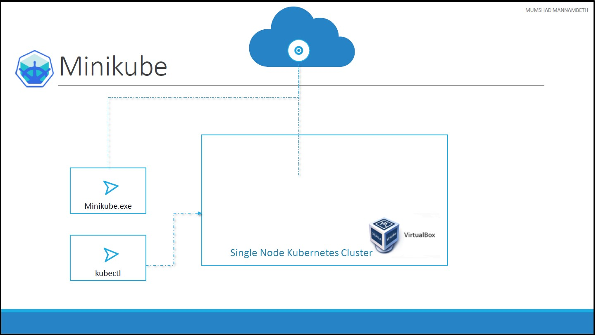

# Unit 3: Setup Kubernetes
There are lots of ways to setup Kuberentes. We can setup it up ourselves locally on our laptops or virtual machines using solutions like [Minikube](https://minikube.sigs.k8s.io/docs/) and [Kubeadm](https://kubernetes.io/docs/reference/setup-tools/kubeadm/).
* Minikube is a tool used to setup a single instance of Kubernetes in an All-in-one setup.
* Kubeadm is a tool used to configure kubernetes in a multi-node setup.

There are also hosted solutions available for setting up kubernetes in a cloud environment such as [GCP](https://cloud.google.com/) and [AWS](https://aws.amazon.com/).  
And finally if you don’t have the resources or if you don’t want to go through the
hassle of setting it all up yourself, and you simply want to get your hands on a
kubernetes cluster instantly to play with, checkout [play-with-k8s.com](https://labs.play-with-k8s.com/).  

## Minikube
Minikube bundles [all of these different components](../unit02-k8s-overview/README.md#Components) into a single image providing us a pre-configured single node kubernetes cluster so we can get started in a matter of minutes.
The whole bundle is packaged into an ISO image and is available online for download.

Minikube provides an [executable](https://minikube.sigs.k8s.io/docs/start/) command line utility that will AUTOMATICALLY download the ISO and deploy it in a virtualization platform such as [Oracle Virtualbox](https://www.virtualbox.org/) or [Vmware fusion](https://www.vmware.com/products/fusion.html). So you must have a Hypervisor installed on your system. For windows you could use Virtualbox or [Hyper-V](https://learn.microsoft.com/en-us/virtualization/hyper-v-on-windows/about/) and for Linux use Virtualbox or [KVM](https://www.linux-kvm.org/page/Main_Page).

And finally to interact with the kubernetes cluster, you must have the `kubectl` kubernetes command line tool also installed on your machine.  
So you need 3 things to get this working, you must have a hypervisor installed, kubectl installed and minikube executable installed on your system.

