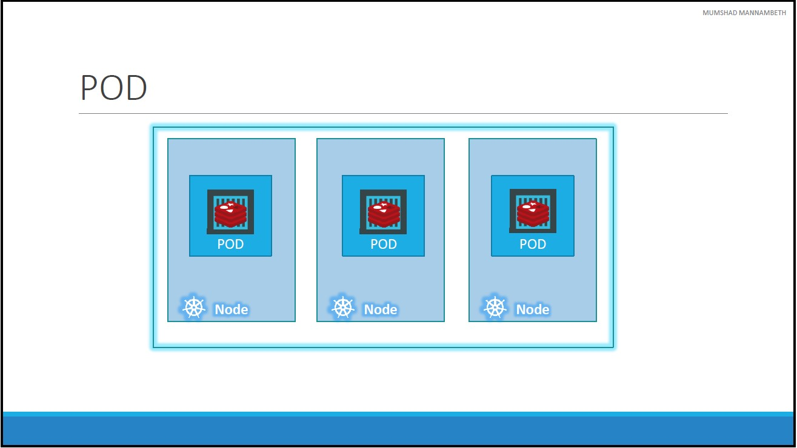
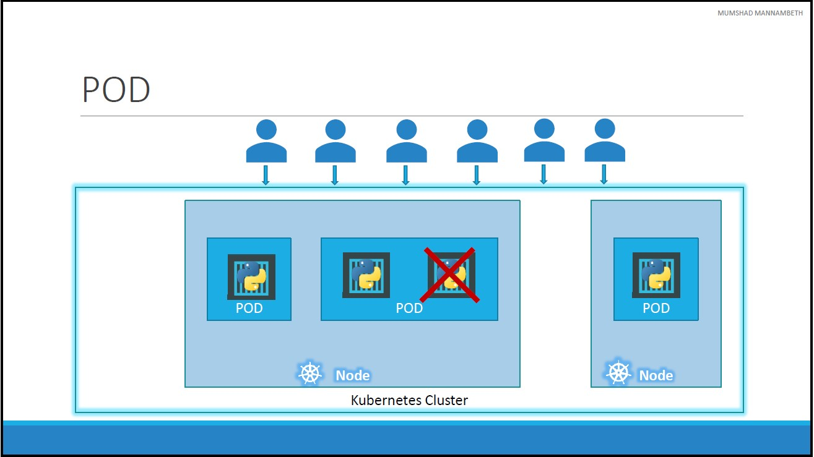
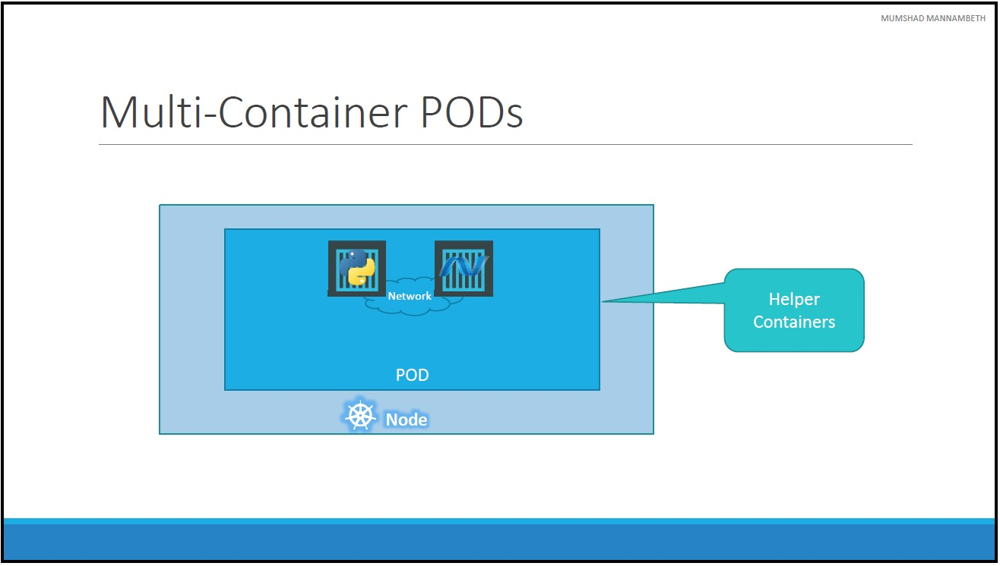
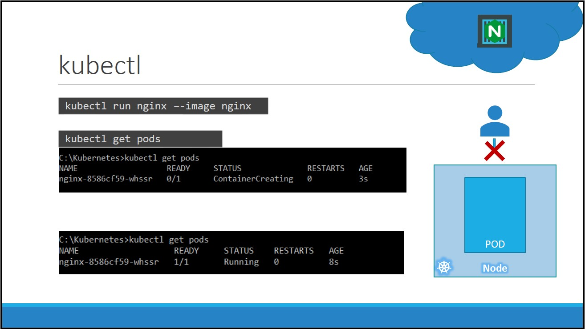

# Unit 4: Kubernates Concepts
In this lecture we will discuss about Kubernetes PODs.

## Pods

* With kubernetes our ultimate aim is to deploy our application in the form of containers on a set of machines that are configured as worker nodes in a cluster.
* However, kubernetes does not deploy containers directly on the worker nodes. The containers are encapsulated into a Kubernetes object known as PODs.
* A POD is a single instance of an application. 
* A POD is the smallest object, that you can create in kubernetes.


* Here we see the simplest of simplest cases were you have a single node kubernetes cluster with a single instance of your application running in a single docker container encapsulated in a POD.
* If the number of users accessing your application increase and you need to scale your application, You need to add additional instances of your web application to share the load.
* To scale up, we create a new POD altogether with a new instance of the same application. 
* As you can see we now have two instances of our web application running on two separate PODs on the same kubernetes system or node.
* If the user base FURTHER increases and your current node has no sufficient capacity, THEN you can always deploy additional PODs on a new node in the cluster. You will have a new node added to the cluster to expand the cluster's physical capacity.
* You do not add additional containers to an existing POD to scale your application.


## Multi Container PODs

* Are we restricted to having a single container in a single POD? No! 
* A single POD CAN have multiple containers, except for the fact that they are usually notmultiple containers of the same kind.
* Sometimes you might have a scenario were you have a helper container, that might be doing some kind of supporting task for our web application such as processing a user entered data, processing a file uploaded by the user etc. and you want these helper containers to live along side your application container. 
* You CAN have both of these containers part of the same POD, so that when a new application container is created, the helper is also created and when it dies the helper also dies since they are part of the same POD.
The two containers can also communicate with each other directly by referring to each other as `localhost` since they share the same network namespace. Plus they can easily share the same storage space as well.
* However, multi-pod containers are a rare use case and we are going to stick to single container per POD in this course.

## kubectl
The `kubectl run` command deploys a docker container by creating a POD.



```console
kubectl run nginx --image nginx
```

* It first creates a POD automatically and deploys an instance of the _nginx_ docker image.
* you need to specify the image name using the `–-image` parameter.
* The application image, in this case the [nginx](https://hub.docker.com/_/nginx) image, is downloaded from the [docker hub](https://hub.docker.com/) repository.
* You could configure kubernetes to pull the image from the public docker hub or a private repository within the organization.

* How do we see the list of PODs available? The `kubectl get pods` command helps us see the list of pods in our cluster

    ```console
    kubectl get pods
    ```

* In this case we see the pod is in a **ContainerCreating** state and soon changes to a Running state when it is actually **Running**.
* In the current state we haven't made the web server accessible to external users. You can access it internally from the Node though.

* When providing the _wide_ option for the `get pods` command, we get extra info:

    ```console
    kubectl get pods -o wide
    ```

* We can also use `kubectl describe pod <pod_name>` command to get more detailed info about a POD.

    ```console
    kubectl describe pod nginx
    ```

[<<Previous](../unit03-setup-k8/README.md) | [Next>>]()