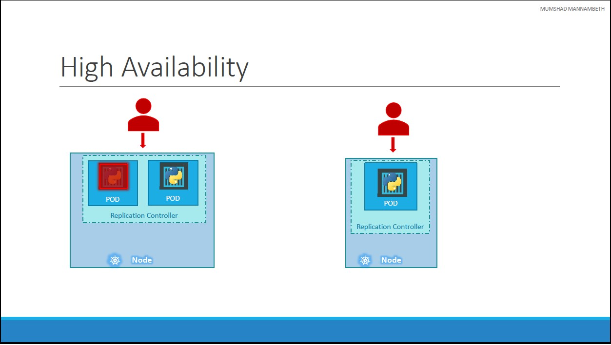
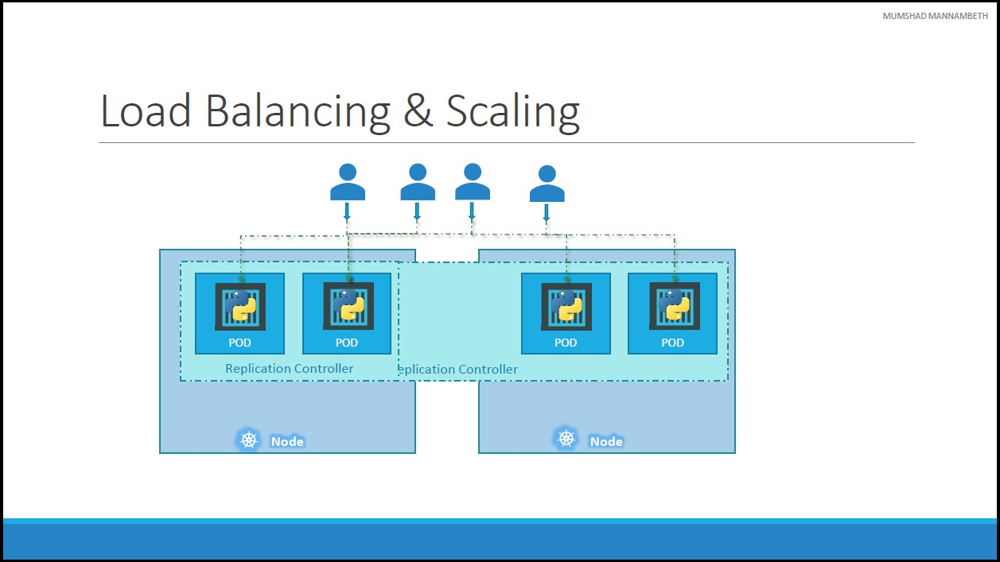

# Unit 6: Kubernetes Concepts - PODs, ReplicaSets, Deployment
## PODs
This section is about creating a POD using a YAML based configuration file.

* Kubernetes uses YAML files as input for the creation of objects such as PODs, Replicas, Deployments, Services etc.
* A kubernetes definition file always contains 4 top level fields. These are all **REQUIRED** fields, so you **MUST** have them in your configuration file
1. `apiVersion`: This is the version of the kubernetes API we’re using to create the object. Depending on what we are trying to create we must use the **RIGHT** `apiVersion`
    * For now since we are working on PODs, we will set the `apiVersion` as `v1`.
2. `kind`: refers to the type of object we are trying to create, which in this case happens to be a POD. 
    * Other possible values here could be `ReplicaSet` or `Deployment` or `Service`:
        Kind | Version
        -----|--------
        Pod | v1
        Service | v1
        ReplicaSet | apps/v1
        Deployment | apps/v1
3. `metadata`: is data about the object like its name, labels etc. 
    * It’s **IMPORTANT** to note that under metadata, you can only specify name or labels or anything else that kubernetes expects to be under metadata. 
    * You **CANNOT** add any other property as you wish under this. However, under labels you **CAN** have any kind of key or value pairs as you see fit. 
    * So it's **IMPORTANT** to understand what each of these parameters expect.
4. `spec`: object we are going to create, this is were we provide additional information to kubernetes pertaining to that object. 
    * This is going to be different for different objects, so its important to understand or refer to the documentation section to get the right format for each.

In the [example](./code-example/PODs/pod-definition.yml), the YAML file descibes a POD which contain single container of `nginx` image.

### POD example

```yml
apiVersion: v1
kind: Pod
metadata:
  name: myapp-pod
  labels:
    app: myapp 
spec:
  containers:
  - name: nginx-container
    image: nginx
```

### Commands 
* Once the file is created, run the command `kubectl create -f` followed by the file name which is _pod-definition.yml_ and kubernetes creates the pod.
    ```bash
    kubectl create -f pod-definition.yml
    ```
* Also, we can use the `apply` command:
    ```bash
    kubectl apply -f pod-definition.yml
    ```
* To check running pods:
    ```bash
    kubectl get pods
    ```
* To get details of **myapp-pod** pod
    ```bash
    kubectl describe pod myapp-pod
    ```

## Tips & Tricks
### IDEs
* There are many IDEs that make working with YAML files easier.
* Our prefered IDE is [VS Code](https://code.visualstudio.com/) which is a free code editor that can be extended using free extensions.

### VS Code Extensions
**VS Code** have a rich set extenstions that add many useful features.

#### YAML
* [YAML](https://marketplace.visualstudio.com/items?itemName=redhat.vscode-yaml) extension enables syntax highlighting and validation of YAML files.
* Since YAML is used many technologies other than Kubernates, we can to configure the YAML extension to **validate** and **auto-complete** YAML Kubernates schema:
```json
{
    "yaml.schemas": {
        "kubernetes": "*.yml"
    }
}
```
* Code example of using the auto-complete feature of YAML extenstion is [nginx.yml](./code-example/PODs/nginx.yml)
* Code example of adding environment variable(s) to container is [postgres.yml](./code-example/PODs/postgres.yml)

## Kubernates Controllers
* Controllers are the brain behind Kubernetes.
* They are processes that monitor kubernetes objects and respond accordingly.
### Why Replication Controllers?
So what is a replica and why do we need a replication controller?
#### High Availability

Let's assume -for some reason- our application crashes and the POD fails.
* To prevent users from losing access to our application, we would like to have more than one instance or POD running at the same time.
* The replication controller helps us run multiple instances of a single POD in the kubernetes cluster thus providing High Availability.
* Even if you have a single POD, the replication controller can help by automatically bringing up a new POD when the existing one fails.
* The replication controller ensures that the specified number of PODs are running at all times. Even if it’s just 1 or 100.
#### Load Balancing & Scaling

* Another reason we need replication controller is to create multiple PODs to share the load across them.
* For example: 
    * In this simple scenario we have a single POD serving a set of users. 
    * When the number of users increase we deploy additional POD to balance the load across the two pods. 
    * If the demand further increases and If we were to run out of resources on the first node, we could deploy additional PODs across other nodes in the cluster.
    * The replication controller spans across multiple nodes in the cluster. 
    * It helps us balance the load across multiple pods on different nodes as well as scale our application when the demand increases.
### Replication Controller vs Replica Set
There are two similar terms. Both have the same purpose but they are not the same. Same characteristics we discussed previously remain applicable to both these technologies.
* **Replication Controller**: is the older technology that is being replaced by Replica Set.
* **Replica Set**: is the new recommended way to setup replication.

#### YAML definition
As with any kubernetes definition file, we will have 4 sections.
* `apiVersion`
* `kind`
* `metadata`
* `spec`

Controller Type | apiVersion | kind | metadata | spec
----------------|------------|------|----------|-----
Replication Controller | v1 | ReplicationController | `name`<br>`labels` | `template`<br>`replicas`<br>`selector`<br>Details [Below](#replication-controller-specs)
Replica Set | apps/v1 | ReplicaSet | `name`<br>`labels` | `template`<br>`replicas`<br>`selector`<br>Details [Below](#replica-set-specs)


##### Replication Controller `specs`
* In the case of `kind: ReplicationController`, we know that it will create multiple instances of a POD so we create `template` of the POD.
* The POD definition under `template` will be same as the [POD definition](#pod-example) like what we created before except for the first two lines which are `apiVersion` and `kind`.
* To define how many number PODs will be launched by the the Replication Controller, we define element `replicas` which is assigned with the number of the replicas to be created.
* **Optionally**, we can add a `selector` definition
    * Replica Set can **ALSO** manage pods that were not created as part of the Replica Set creation.
    * It is a criteria to define which PODs are managed by the Replication Controller.
    * Replication Controller can **ALSO** manage pods that were not created as part of the Replication Controller creation.
    * And it has to be written in the form of `matchLabels`.
    * The `matchLabels` selector simply matches the labels specified under it to the labels on the PODs.

##### Replication Controller `specs` example
```yml
spec:
  template:
    metadata:
      name: myapp-pod
      labels:
        app: myapp
        type: front-end
    spec:
      containers:
        - name: nginx-container
          image: nginx
  replicas: 3
```

##### Replica Set `specs`
* In the case of `kind: ReplicaSet`, we know that it will create multiple instances of a POD so we create `template` of the POD.
* The POD definition under `template` will be same as the [POD definition](#pod-example) like what we created before except for the first two lines which are `apiVersion` and `kind`.
* To define how many number PODs will be launched by the the Replication Controller, we define element `replicas` which is assigned with the number of the replicas to be created.
* Replica Set **MUST** have a `selector` definition.
    * Replica Set can **ALSO** manage pods that were not created as part of the Replica Set creation.
    * And it has to be written in the form of `matchLabels`
    * The `matchLabels` selector simply matches the labels specified under it to the labels on the PODs.
    * The ReplicaSet selector also provides many other options for matching labels that were not available in a Replication Controller.

##### Replica Set `specs` example
```yml
spec:
  template:
    metadata:
      name: myapp-pod
      labels:
        app: myapp
        type: front-end
    spec:
      containers:
        - name: nginx-container
          image: nginx
  replicas: 3
  selector:
    matchLabels:
      type: front-end
```

#### Full examples:
* [Replication Controller](./code-example/ReplicatioControllers/rc-definition.yml)
* [Replica Set](./code-example/ReplicaSets/replicaset-definition.yml)

#### Commands
##### Replication Controllers
* Create Replication Controller based on YAML file
    ```bash
    kubectl create -f rc-definition.yml
    ```
* List Replication Controllers
    ```bash
    kubectl get replicationcontroller
    ```
* List Pods
    ```bash
    kubectl get pods
    ```
* Delete Replication Controller
    ```bash
    # Also delete underlying PODs
    kubectl get replicationcontroller myapp-replicationcontroller
    ```
##### Replica Set
* Create Replica Set based on YAML file
    ```bash
    kubectl create -f replicaset-definition.yml
    ```
* List Replica Sets
    ```bash
    kubectl get replicaset
    ```
* List Pods
    ```bash
    kubectl get pods
    ```
* Delete Replica Set
    ```bash
    # Also delete underlying PODs
    kubectl get replicaset myapp-replicaset
    ```

### Labels and Selectors
* The role of the replicaset is to monitor the pods and if any of them were to fail, deploy new ones.
* The replica set is in FACT a process that monitors the pods.
* Labels of PODs enable the replica sets to know which PODs to manage/monitor. 
* Under the `selector` section we use the `matchLabels` filter and provide the same label that we used while creating the pods.
* For the replica set to create a new POD, the `template` definition section **IS required** BECAUSE in case one of the PODs (**even PODs created outside the replica set**) were to fail in the future, the replicaset needs to create a new one to maintain the desired number of PODs.

### Scale
There are multiple ways to scale a replica set:
1. Edit the replica set YAML definition file to modify the number of `replicas` and execute `kubectl replace` command:
    ```bash
    kubectl replace -f replicaset-definition.yml
    ```
    * Using the file name as input **will not** result in the number of replicas being updated automatically in the file.
2. Run the `kubectl scale` command and use the `--replicas` parameter to provide the new number of replicas **and specify the same file as input**.
    ```bash
    kubectl scale --replicas=6 -f replicaset-definition.yml
    ```
3. Run the `kubectl scale` command and use the `--replicas` parameter to provide the new number of replicas and _TYPE_ and _NAME_
    ```bash
    kubectl scale --replicas=6 replicaset myapp-replicaset
    ```
    * **TYPE**: replicaset
    * **NAME**: name of the replica set

There are also options available for automatically scaling the replicaset based on load, but that is an advanced topic.

[<<Previous](../unit05-yaml-introduction/README.md) | [Next>>]()