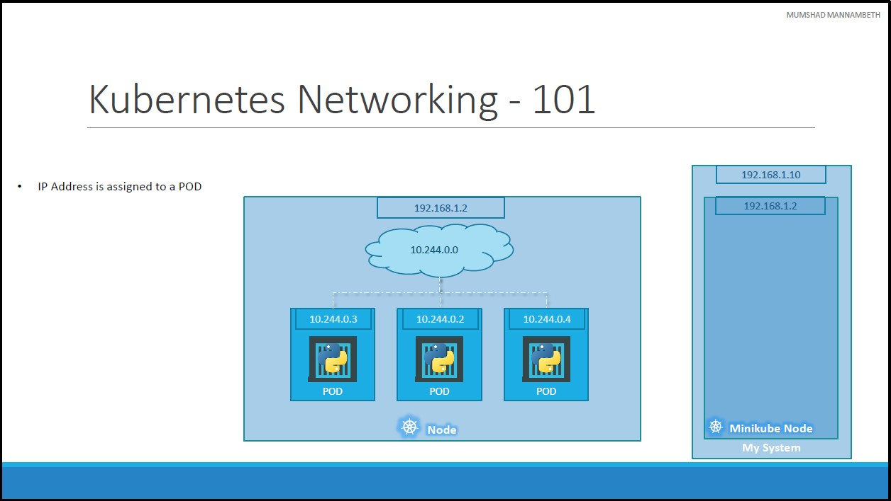

# Networking in Kibernates
## Kubernetes Networking - 101

At the very basics of networking in Kubernetes. We will start with a single node kubernetes cluster.
* The node has an IP address, say it is `192.168.1.2` in this case.
* This is the IP address we use to access the kubernetes node, SSH into it etc.
    * If you are using a **MiniKube** setup, then I am talking about the IP address of the minikube virtual machine inside your Hypervisor. 
    * So it is important to understand how VMs are setup.
* So on the single node kubernetes cluster we have created a Single POD. A POD hosts a container.
* Unlike in the docker world where an IP address is always assigned to a Docker CONTAINER, in Kubernetes the IP address is assigned to a POD.
* Each POD in kubernetes gets its own internal IP Address. 
    * In this case it is in the range `10.244` series and the IP assigned to the POD is `10.244.0.2`.
* So how is it getting this IP address?
    * When Kubernetes is initially configured it creates an internal private network with the address `10.244.0.0` and all PODs are attached to it.
    * When you deploy multiple PODs, they all get a separate IP assigned.
    * The PODs can communicate to each other through this IP.
    * But accessing other PODs using this internal IP address **may NOT** be a good idea as it is subject to change when PODs are recreated.

[<<Previous](../unit06-k8s-concepts-pods-replicaSets-deployment/README.md) | [Next>>]()