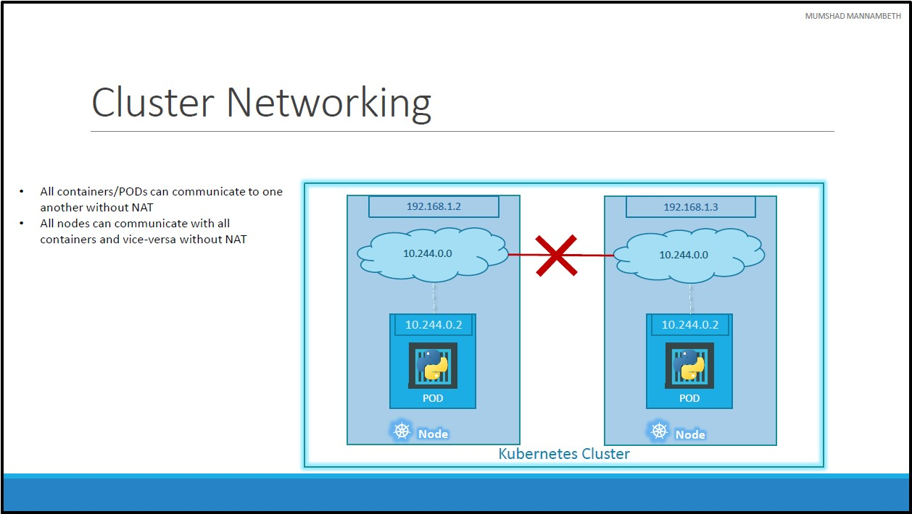
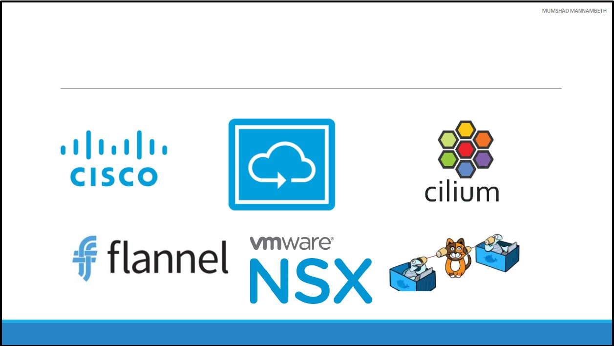
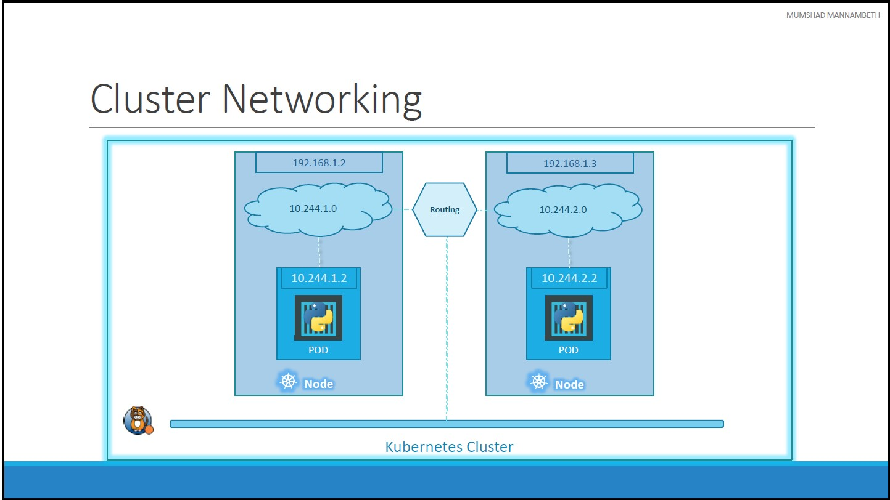

# # Unit 7: Networking in Kibernates
## Kubernetes Networking - 101

At the very basics of networking in Kubernetes. We will start with a single node kubernetes cluster.
* The node has an IP address, say it is `192.168.1.2` in this case.
* This is the IP address we use to access the kubernetes node, SSH into it etc.
    * If you are using a **MiniKube** setup, then I am talking about the IP address of the minikube virtual machine inside your Hypervisor. 
    * So it is important to understand how VMs are setup.
* So on the single node kubernetes cluster we have created a Single POD. A POD hosts a container.
* Unlike in the docker world where an IP address is always assigned to a Docker CONTAINER, in Kubernetes the IP address is assigned to a POD.
* Each POD in kubernetes gets its own internal IP Address. 
    * In this case it is in the range `10.244` series and the IP assigned to the POD is `10.244.0.2`.
* So how is it getting this IP address?
    * When Kubernetes is initially configured it creates an internal private network with the address `10.244.0.0` and all PODs are attached to it.
    * When you deploy multiple PODs, they all get a separate IP assigned.
    * The PODs can communicate to each other through this IP.
    * But accessing other PODs using this internal IP address **may NOT** be a good idea as it is subject to change when PODs are recreated.
## Cluster Networking

How does it work when you have multiple nodes in a cluster?
* In this case we have two nodes running kubernetes and they have IP addresses `192.168.1.2` and `192.168.1.3` assigned to them. 
* Note that they are not part of the same cluster yet.
* Each of them has a single POD deployed.
* These pods are attached to an internal network and they have their own IP addresses assigned.
* If you look at the network addresses, you can see that they are the same. 
* The two networks have an address `10.244.0.0` and the PODs deployed have the same address too.
* This is **NOT** going to work well when the nodes are part of the same cluster. The PODs have the same IP addresses assigned to them and that will lead to IP conflicts in the network.
* When a kubernetes cluster is SETUP, kubernetes does **NOT** automatically setup any kind of networking to handle these issues.
* As a matter of fact, kubernetes expects US to setup networking to meet certain fundamental requirements. Some of these are that:
    * All the containers or PODs in a kubernetes cluster MUST be able to communicate with one another without having to configure _NAT_.
    * All nodes must be able to communicate with containers and all containers must be able to communicate with the nodes in the cluster.
* Kubernetes expects US to setup a networking solution that meets these criteria.
* We don’t have to set it up ALL on our own as there are multiple pre-built solutions available.

* Some of them are
    * [Cisco ACI networks](https://www.cisco.com/c/en/us/td/docs/switches/datacenter/aci/apic/sw/kb/b_Kubernetes_Integration_with_ACI.html)
    * [Cilium](https://cilium.io/)
    * [Converged Cloud Fabric](https://www.arista.com/en/products/converged-cloud-fabric) (previuosly known as _Big Cloud Fabric_)
    * [flannel](https://github.com/flannel-io/flannel)
    * [Vmware NSX-T](https://www.vmware.com/mena/products/nsx.html)
    * [Calico](https://www.tigera.io/project-calico/)
    * [WeaveNet](https://www.weave.works/oss/net/)
* Depending on the platform you are deploying your Kubernetes cluster on you may use any of these solutions. For example:
    * If you were setting up a kubernetes cluster from scratch on your own systems, you may use any of these solutions like **Calico**, **Flannel** etc.
    * If you were deploying on a **Vmware** environment **NSX-T** may be a good option.
    * If you look at the [play-with-k8s](https://labs.play-with-k8s.com/) labs they use **WeaveNet**.
* Depending on your environment and after evaluating the Pros and Cons of each of these, you may chose the right networking solution.

* So back to our example cluster, with the **Calico** networking setup, it now manages the networks and IPs in out nodes and assigns a different network address for each network in the nodes.
* This creates a virtual network of all PODs and nodes where they are all assigned a unique IP Address.
* By using simple routing techniques the cluster networking enables communication between the different PODs or Nodes to meet the networking requirements of kubernetes.
* Thus all PODs can now communicate to each other using the assigned IP addresses.

[<<Previous](../unit06-k8s-concepts-pods-replicaSets-deployment/README.md) | [Next>>](../unit08-services/README.md)