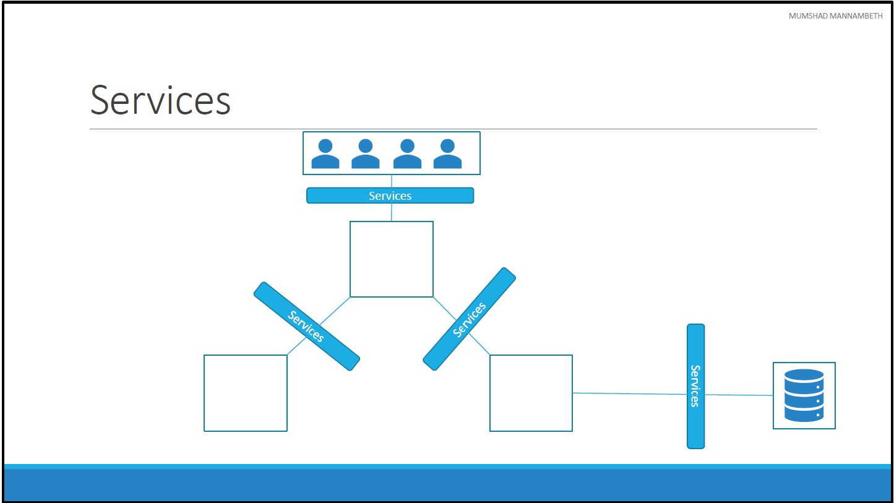
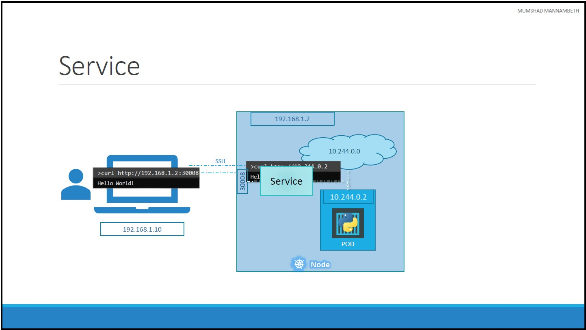
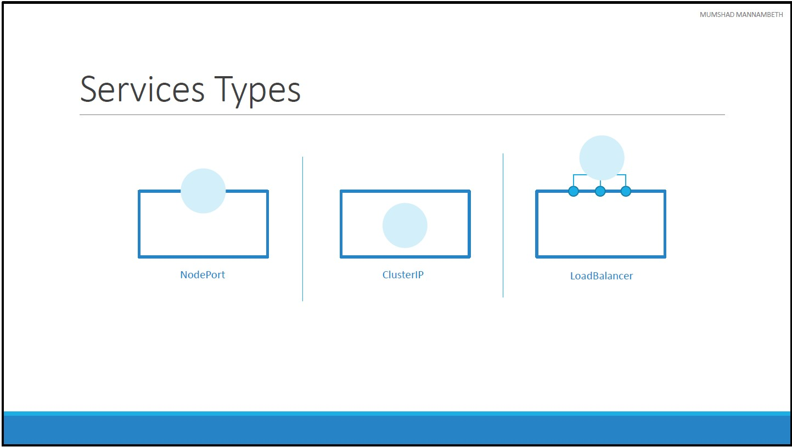
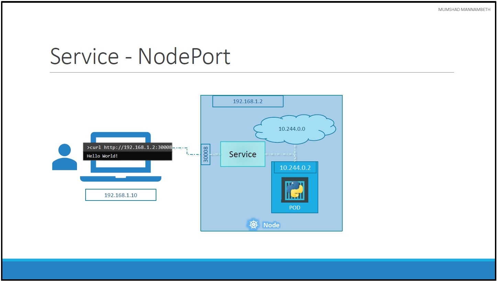
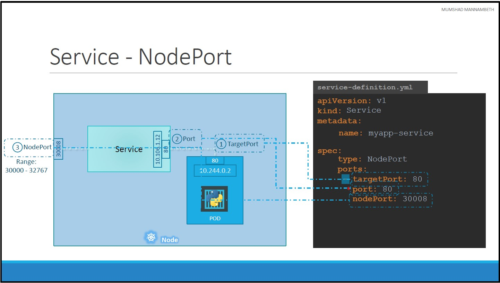
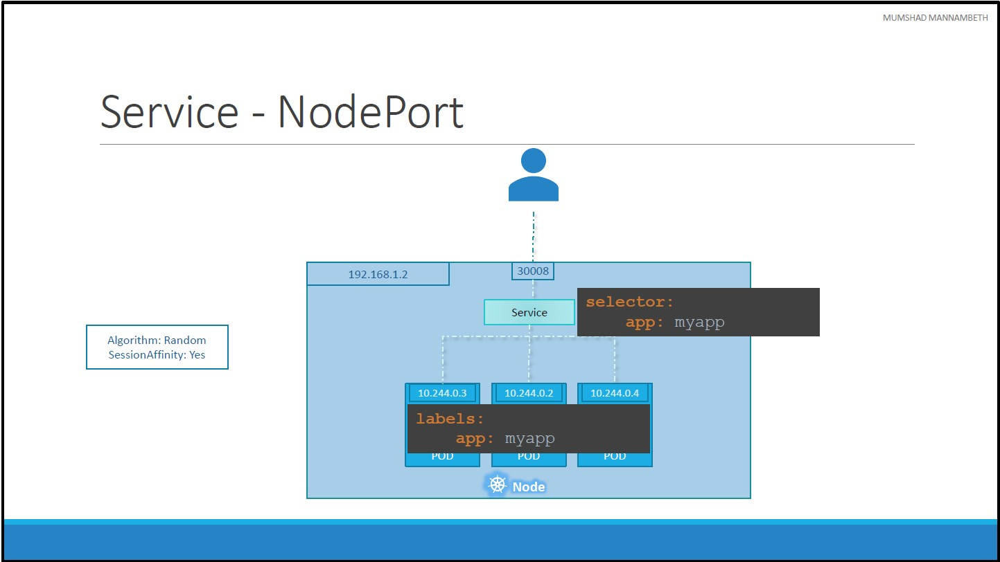
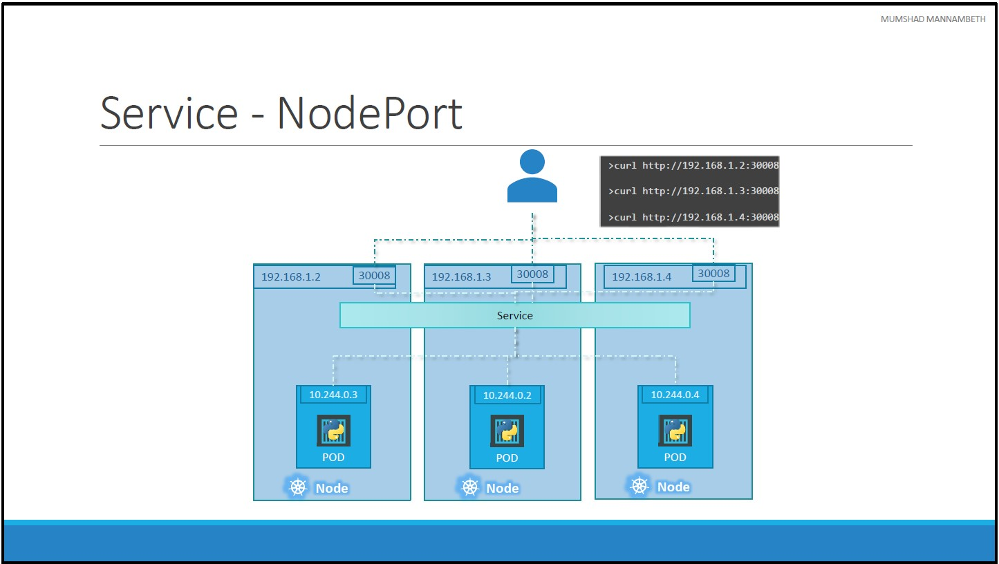
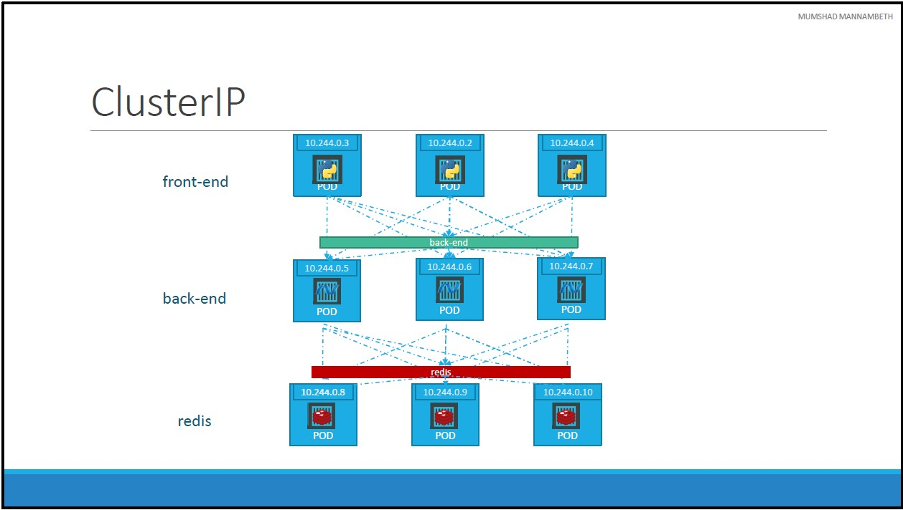

# Unit 8: Services
## Introduction

* Kubernetes **Services**:
    * Enable communication between various components within and outside of the application.
    * Help us connect applications together with other applications or users.
* For example, our application has groups of PODs running various sections, such as:
    * A group for serving front-end load to users
    * Another group running back-end processes
    * A third group connecting to an external data source.
* It is **Services** that enable connectivity between these groups of PODs.
    * Services enable the front-end application to be made available to users
    * It helps communication between back-end and front-end PODs
    * And helps in establishing connectivity to an external data source.
    * Thus services enable loose coupling between microservices in our application.
## Services Use Case

* Let’s take a look at one use case of Services. Lets look at the existing setup:
    * The Kubernetes Node has an IP address and that is `192.168.1.2` and the laptop is on the same network as well, so it has an IP address `192.168.1.10`.
    * The internal POD network is in the range `10.244.0.0` and the POD has an IP `10.244.0.2`. 
* Clearly, we cannot ping or access the POD at address `10.244.0.2` as it is in a separate network. So what are the options to see the webpage?
* If we were to SSH into the kubernetes node at `192.168.1.2`, from the node, we would be able to access the POD’s webpage by doing a curl or if the node has a GUI, we could fire up a browser and see the webpage in a browser following the address http://10.244.0.2.
    * But this is **NOT** a practical solution because this works only from inside the kubernetes Node.
    * We want to be able to access the web server without having to SSH into the node and simply by accessing the IP of the kubernetes node.
    * So we need something in the middle to help us map requests to the node from external machines through the node to the POD running the web container.
    * That is where the kubernetes **Service** comes into play.
* The kubernetes **Service** is an object just like PODs, Replicaset or Deployments.
* One of **Service** use case is to listen to a port on the Node and forward requests on that port to a port on the POD running the web application.
* This type of service is known as a **NodePort** service because the service listens to a port on the Node and forwards requests to PODs. 
* There are other kinds of services available which we will now discuss.
## Services Types

### NodePort

* **NodePort** is the service that makes an internal POD accessible on a Port on the Node.

* In the above example, there are 3 ports involved.
    1. **TargetPort**: The port on the POD where the actual web server is running is port `80`.
    2. The **Port**: is the port on the service itself.
    3. **NodePort**: We use to access the web server externally.
        * NodePorts can only be in a valid range which is from `30000` to `32767`.
* Note that the `ports` property is an **array**. You can have multiple such port mappings within a single service.
* We will connect the **NodeService** to POD(s) through `lables` by adding `selector` property, like we did with **ReplicaSets**.
* These terms are from the viewpoint of the **Service**. The **Service** is in fact like a virtual server inside the node.
* Inside the cluster it has its own IP address. And that IP address is called the Cluster IP of the service.

#### NodePort selector

* In a production environment you have multiple instances of your web application running for high availability and load balancing purposes.
* All those PODs will have the same label. So when the **Service** is created, it looks for matching PODs with the labels and finds all of them.
* The service then automatically selects all the PODs as endpoints to forward the external requests coming from the user.
* The algorithm used to balance load is a **random algorithm**. Thus the service acts as a built-in load balancer to distribute load across different PODs.


#### NodePort YAML
* [Code Example](./code-examples/NodePort/service-definition.yml)
    ```yml
    apiVersion: v1
    kind: Service
    metadata:
    name: myapp-service
    spec:
    type: NodePort
    ports:
        - port: 80
        targetPort: 80
        nodePort: 30004
    selector:
        app: myapp
    ```
* Create a **Service** based on a YAML definition file
    ```bash
    kubectl create -f ./service-definition.yml
    ```
* List Services
    ```bash
    kubectl get service
    ```
* Get Service details by **minikube**
    ```bash
    minikube service myapp-service
    ```
* Get ONLY Service URL by **minikube**
    ```bash
    minikube service myapp-service --url
    ```
### ClusterIP
* **ClusterIP** service creates a virtual IP inside the cluster to enable communication between different services such as a set of front end servers to a set of backend servers.

* A full stack web application typically has different kinds of PODs hosting different parts of an application.
    * You may have a number of PODs running:
    * A front-end web server
    * Another set of PODs running a backend server
    * A set of PODs running a key value store like Redis
    * Another set of PODs running a persistent database like MySQL etc.
* The web front end servers need to connect to the backend workers and the backend workers need to connect to database as well as the redis services.
* The PODs all have an IP address assigned to them as we can see on the screenshot.
* But these IPs as we know are not static, these PODs can go down anytime and new PODs are created all the time and so we CANNOT rely on these IP addresses for internal communication within the application.
* A kubernetes service can help us group these PODs together and provide a single interface to access the PODs in a group.
* For example:
    * A service created for the backend PODs will help group all the backend PODs together and provide a single interface for other PODs to access this service.
    * The requests are forwarded to one of the PODs under the service randomly.
    * Similarly, create additional services for Redis and allow the backend PODs to access the Redis system through this service.
* This enables us to easily and effectively deploy a microservices based application on kubernetes cluster.
* Each layer can now scale or move as required without impacting communication between the various services.
* Each service gets an IP and name assigned to it inside the cluster and that is the name that should be used by other PODs to access the service.
* This type of service is known as **ClusterIP**
#### YAML definition
* Under ports we have a `targetPort` and `port`:
    * **targetPort**: is the port were the back end is exposed, which in this case is 80.
    * **port**: is where the service is exposed. Which is 80 as well.
 * To link the service to a set of PODs, we use `selector`.
```yml
apiVersion: v1
kind: Service
metadata:
  name: back-end
spec:
  type: ClusterIP
  ports:
    - port: 80
      targetPort: 80
  selector:
    app: myapp
```

### LoadBalancer
* **LoadBalancer** service provisions a load balancer for our service in supported cloud providers.
* A good example of that would be to distribute load across different web servers.

[<<Previous](../unit07-k8s-networking/README.md) | [Next>>]()