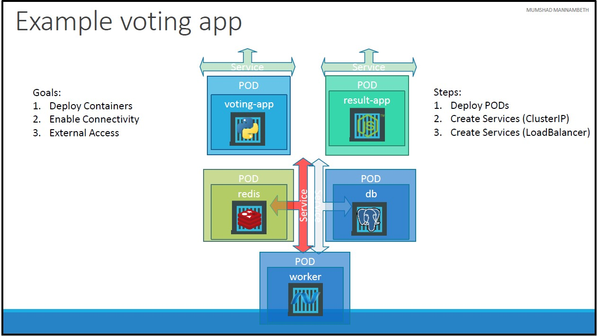

# Unit 9: Microservices Architecture
In this unit, we will try to understand Microservices Architecture through an example application.
## Sample Application - Voting Application
This is a voting application which provides 2 web interfaces:
1. Web Interface for the user to enter the vote.
2. Web Interface for the user to see the result.
### Application Architecture
The application consists of several components:
* **voting-app**: A web application developed in [Python](https://www.python.org/) to provide the user to choose between 2 options: _CATS_ and _DOGS_.
* **redis** in-memory DB: A [redis](https://redis.io/) database which stores the user's choise from the **voting-app**.
* **worker-app**: An application written in [.NET](https://dotnet.microsoft.com/en-us/) which processes the user's voting record stored in redis **in-memory DB** and update the persistent database.
* **postgres** database: A [PostgreSQL](https://www.postgresql.org/) database which has a table with the number of votes for each category. The **worker-app** is responsible for updating this table based on votes registered in the **redis**.
    CATS | DOGS
    -----|-----
    0 | 1
* **result-app**: A web application written in [Node.js](https://nodejs.org/en/) that displays the results of the votes stored in the [PostgreSQL](https://www.postgresql.org/) database.
The application is built by different tools and different development platforms.

## Deploying Microservices Architecture on Kubernates
### Planning Deployment on Kubernates
Before we deploy our [Sample Application](#sample-application---voting-application), we need to plan our deployment based on our [application architecture](#application-architecture).

* Goals:
    1. Deploy Containers
        * We cannot deploy containers directly but we can deploy PODs(or ReplicaSets or Deployments).
    2. Enable Connectivity
        * **redis** is accessed by **voting-app** and **worker-app**.
        * **postgres** database is accessed by **result-app** and **worker-app**.
        * **worker-app** is NOT accessed by any component or extrnal user.
        * **redis** is listening on `port 6379`
        * **postgres** is listening on `port 5432`
    3. External Access
        * **voting-app** and **result-app** are accessed by external users through `port 80` for both apps.
* Steps:
    1. Deploy PODs
        * **voting-app**: Docker image [kodekloud/examplevotingapp_vote:v1](https://hub.docker.com/r/kodekloud/examplevotingapp_vote)
        * **redis**: Official [redis](https://hub.docker.com/_/redis) docker image.
        * **worker-app**: Docker image [kodekloud/examplevotingapp_worker:v1](https://hub.docker.com/r/kodekloud/examplevotingapp_worker)
        * **postgres**: Official [PostgreSQL](https://hub.docker.com/_/postgres) docker image.
        * **result-app**: Docker image [kodekloud/examplevotingapp_result:v1](https://hub.docker.com/r/kodekloud/examplevotingapp_result)
    2. Create Services (ClusterIP)
        * **redis** service for POD **redis**.
        * **db** service for **postgres** database POD.
    3. Create Services (NodePort)
        * **voting-app** service.
        * **result-app** service.

[<<Previous](../unit08-services/README.md) | [Next>>]()